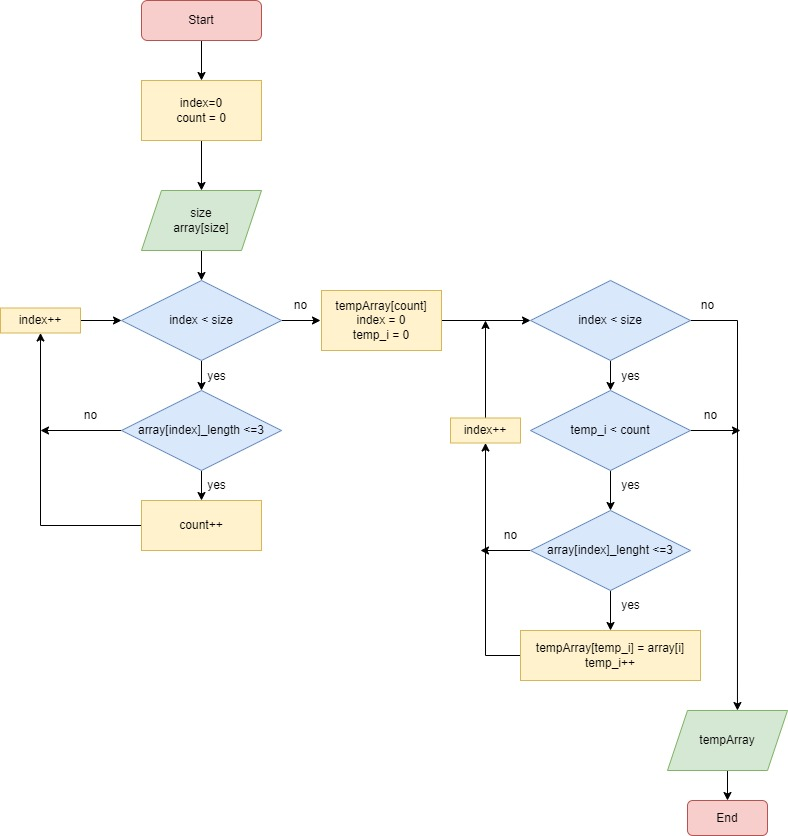

# **Итоговая проверочная работа по итогу прохождения первого блока обучения по программе разработчик.** 

## *Задание*

## *Блок-схема алгоритма*

Если кратко, то задумка такова:
1. Пользователь задает размер строкового массива и вводит каждый элемент
2. Одновременно, используя цикл проверяем элементы строкового массива на условие меньше или равно 3 символам. 
3. В итоге получаем размер для второго массива, куда поместим элементы, удовлетворяющие условию задачи
4. Через цикл записываем нужные элементы в новый массив
5. Выводим на экран результат выполнения

## *Описание программы*

Программа состоит из трех частей:

1. Ввод массива с помощью пользователя. Он задает строковый массив (указывает размер, вводит элементы массива).
2. Создана функция GetElementMaxLength, с помощью которой реализована задача по поиску элементов, которые будут удовлетворять условию и переносится в новый массив строк.
3. Запуск функции, указав аргументы: массив строк, который мы сформировали ранее и количество символов для отбора, одновременно выводится результат в консоль в форматированном виде.

